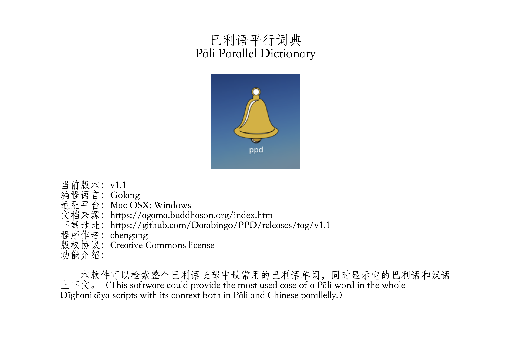

# PPD: A Pāli Parallel Dictionary

## Screenshot

## Support OS
- Mac
- Windows

## Download
- Mac: https://github.com/Databingo/PPD/releases/download/v1.1/ppd.dmg
- Windows: https://github.com/Databingo/PPD/releases/download/v1.1/ppd.zip

## Install & Usage
Double click to install & typing words in search bar.

## About development:
- 1.Currently only support Dīghanikāya and its Chinese version, may be more documents could to be imported.
- 2.Currently only support Chinese language, may be more languages could to be imported, such as Thai, Deutsch, etc.
- 3.Maybe could deploy a gramma parser that analyzing Pāli&Sanskrit sentence into different tense/declension case parts according to the Pāṇini grammar rules.

## Acknowledgements
The Chinese translation comes from https://agama.buddhason.org/index.htm

